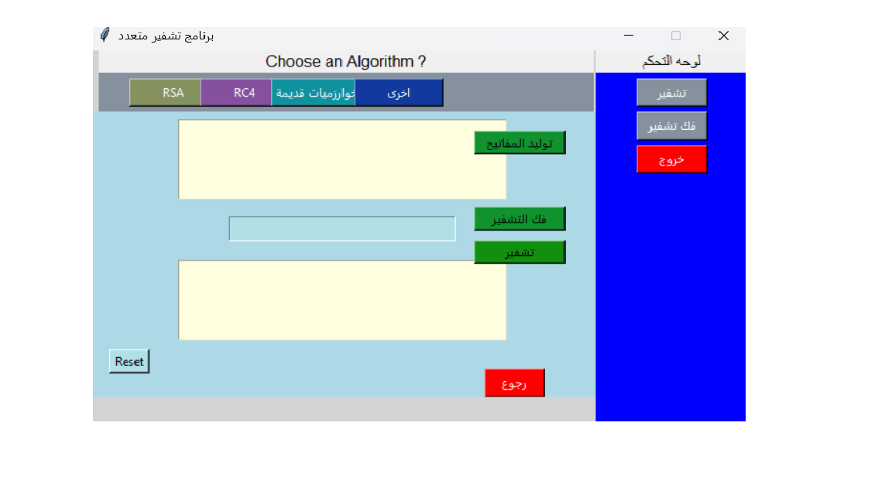
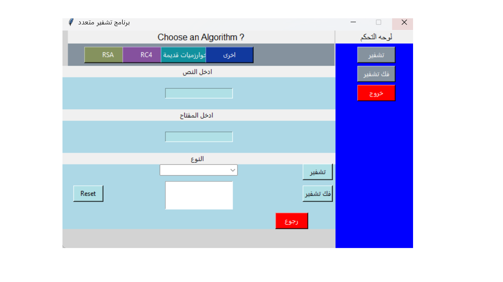
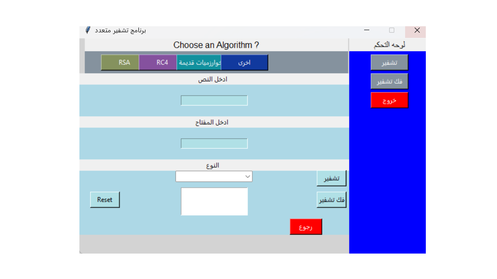

# 🛡️ Python Encryption Toolkit | برنامج التشفير باستخدام بايثون


---

## 📌 Overview | نظرة عامة

The **Python Encryption Toolkit** is an open-source Python application that allows users to **encrypt and decrypt messages** using modern and classical algorithms.  
It comes with an **interactive GUI (Tkinter)** and supports **both English and Arabic**, making it a perfect learning and development tool.  

**Python Encryption Toolkit** هو مشروع  تشفير  بلغة بايثون، يتيح لك تشفير وفك تشفير الرسائل باستخدام مجموعة من الخوارزميات الحديثة والكلاسيكية 
البرنامج مزود بواجهة رسومية تفاعلية باستخدام مكتبة **Tkinter**، ويدعم **اللغتين العربية والإنجليزية**.

---

## 🚀 Features | المميزات

- 🔐 **RSA Encryption** – Generate and exchange public/private keys.  
- 🔁 **RC4 Encryption** – Fast symmetric key encryption.  
- 🏛️ **Classical Algorithms** – Caesar, Multiplicative, Zigzag.  
- 🖥️ **Graphical User Interface (Tkinter)** – Elegant and user-friendly.  
- 🌍 **Full Arabic & English support**.  
- ♻️ **Extra Options** – Reset, clear fields, reinitialize.  
- 🖼️ **Coming Soon**: Image encryption support.  

---

## 🧠 Supported Algorithms | الخوارزميات المدعومة

| Algorithm       | Type        | Quick Description / وصف سريع                  |
|-----------------|-------------|------------------------------------------------|
| **RSA**         | Asymmetric  | Uses public & private keys for secure comms.   |
| **RC4**         | Symmetric   | Simple and fast stream cipher.                 |
| **Caesar**      | Classical   | Shifts each character by a fixed number.       |
| **Multiplicative** | Classical | Based on modular multiplication.              |
| **Zigzag**      | Keyless     | Rearranges text in a rail fence pattern.       |

---

## 🖼️ Interfaces | واجهات التطبيق  

### 🔹 Main GUI | الواجهة الرئيسية  


### 🔹 RSA Interface | واجهة RSA  


### 🔹 RC4 Interface | واجهة RC4  


### 🔹 Classical Algorithms | الخوارزميات الكلاسيكية  


---

## 📦 Installation & Usage | التثبيت والتشغيل

```bash
git clone https://github.com/abdulkaree4m/project-python-encryption.git
cd project-python-encryption
python main.py
